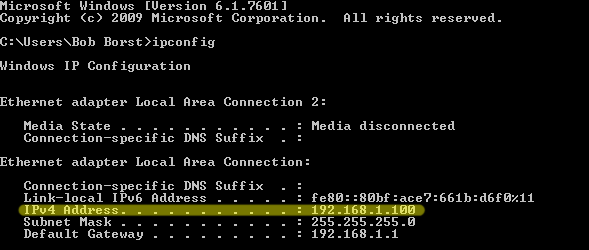

#Gazepoint toolkit for Matlab

##Introduction
This repository holds an API abstraction for Matlab.
The GP3 communicates via the Open Eye-gaze Interface API, which relies on TCP/IP for data transfer. The documentation for this API is available [here](http://gazept.com/dl/Gazepoint_API_v2.0.pdf). The GP3 has been designed for Microsoft Windows 7 and 8 (32- and 64-bit) and requires an Intel Core i5 or higher processor, 8GB RAM and two USB ports. Though the GP3 hardware and software must be ran on a Windows machine you can use its API by opening up the _GazepointControl_ application. Using the GP3 eye-tracker is trivial in any programming platform that allows TCP/IP communication.

##Usage

###Download tool-kit
To begin, downlaod the `gazepoint_connect.m` file and place it in your project directory. Like any other script file that you will use in your Matlab project, be sure to add its path ie: `addpath(scripts/gazepoint_connect.m)`. 
###Finding your IP address
Whether you are running your experiments on the same computer that hosts the eye-tracker, or you are using an external computer, the GP3 uses TCP/IP to communicate. To find out the host computer's ip address, open up the `cmd` application and run `ipconfig`. You will see something like this:


 


The IPv4 is your machine's ip address. 

###Connecting to the Gazepoint Tracker
Once you are able to access the functions in this toolkit make sure that you launch the _GazepointControl_ application on your host computer. The first thing we will want to do in our code is establish a connection or _socket_ between the computer and the GP3. The GP3 broadcasts its data to port 4242 by default, though you do not need to worry about this unless you are running more than one eye tracker on the same machine. 


Run `gazepoint_connect('you.ip.address', 4242)`


If you are using the same machine running the GP3 to run your experiments, you don't need to worry about this. You can simply run `gazepoint_connect()` and it should default to your local ip address.

###Setting up the GP3 and GazepointControl
Images about how to properly setup the distance between subject and actual tracker 

###Hiding the GazepointControl screen
To hide or show the GazepointControl application remotely, use `gazepoint_display(bool)`. Pass it a _0_ to hide, or a _1_ to show.

###Calibration
Run the gazepoint-screen calibration for better results. `gazepoint_calibrate()` will run the calibration sequence and return the calibration results. You need at least four successful calibration points get proper data. 

###Get data
This abstract function gets whatever type of data that you want. Just pass it anything from the following options as a string:
`get_data('ENABLE_SEND_POG_BEST')`
<table>
	<tr>
		<td><b>Type</td>
		<td><b>Command</td>
		<td>Description</td>
	</tr>
	<tr>
		<td>Fixation POG</td>
		<td>ENABLE_SEND_POG_FIX</td>
		<td>The Fixation POG data provides the user’s point-of-gaze as determined by the internal 
fixation filter.
</td>
	</tr>
	<tr>
		<td>Best POG</td>
		<td>ENABLE_SEND_POG_BEST</td>
		<td>The ‘best’ POG data, which is the average of the left eye and right eye POG if 			both are 
			available, or if not, then the value of either the left or right eye, depending 			on which one is valid.</td>
	</tr>
	<tr>
		<td>Left POG</td>
		<td>ENABLE_SEND_POG_LEFT</td>
		<td>The POG data for the user’s left eye</td>
	</tr>
	<tr>
		<td>Right POG</td>
		<td>ENABLE_SEND_POG_RIGHT</td>
		<td>The POG data for the user’s right eye</td>
	</tr>
	<tr>
		<td>Left Eye Pupil</td>
		<td>ENABLE_SEND_PUPIL_LEFT</td>
		<td>The image data relating to the left eye.</td>
	</tr>
	<tr>
		<td>Right Eye Pupil</td>
		<td>ENABLE_SEND_PUPIL_RIGHT</td>
		<td>The image data relating to the left eye.</td>
	</tr>	
	<tr>
		<td>Left Eye 3D Data</td>
		<td>ENABLE_SEND_EYE_LEFT</td>
		<td>The computed 3D data for the left eye position</td>
	</tr>
		<tr>
		<td>Right Eye 3D Data</td>
		<td>ENABLE_SEND_EYE_RIGHT</td>
		<td>The computed 3D data for the right eye position</td>
	</tr>
</table>		


###Clean
After running every session, remember to run `client_clean()` to stop data transmission, disconnect and delete the socket.

###Example

```
gazepoint_connect('192.168.1.100', 4242);
gazepoint_calibrate();
gazepoint_display(0);
get_data('ENABLE_SEND_POG_BEST');
% do something cool with the data
...
client_clean();
```
