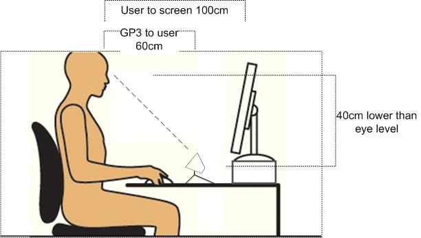

#Gazepoint toolkit for Matlab
[Download](#download-tool-kit) | [Hardware setup](#gp3-hardware-setup)  | [Basic Use](#for-basic-use) | [Advanced Use](#for-advanced-use) | [Command list](#get-data)
##Introduction 
The GP3 communicates via the Open Eye-gaze Interface API, which relies on TCP/IP for data transfer. The documentation for the GP3 API is available [here](http://gazept.com/dl/Gazepoint_API_v2.0.pdf).  Using the GP3 eye-tracker is trivial in any programming platform that allows TCP/IP communication. This repository holds an API abstraction for Matlab.

#Usage

###Requirements
The GP3 has been designed for Microsoft Windows 7 and 8 (32- and 64-bit) and requires an Intel Core i5 or higher processor, 8GB RAM and two USB ports. 

###Download tool-kit
To begin, downlaod the `gazept.m` and `gazept_start.m` files and place it in your project directory. Like any other script file that you will use in your Matlab project, be sure to add its path ie: `addpath(gazept.m)`. 
###GP3 hardware setup
First, open the _Gazepoint Control_ application. Make sure that your subject's eyes are visible in the camera display. The diagram on fig1 shows a proper setup for the GP3.


fig1

The dot in the center of the GP3 application indicates the quality of the user's position. You want to have the dot stay green and on the center of the bar. 
##For basic use
If you are running your Matlab experiment on the same computer that is operating the GP3, and just want a quick and easy way to access the X and Y point of gaze data, this section is for you.

`gazept_start.m` contains simple functions that operate the GP3 at a high level. 
###Setup and calibration
`gazept_start();` will begin by connecting the eye tracker to Matlab and running the default GP3 calibration. The user should follow the dots in the correct sequence. The results are displayed after the sequence is completed. You are able to pass in a delay variable to `gazept_start()` if you wish to extend or shorten the results screen.

```matlab
% by default, gazept_start() uses a 15 second pause
>> gazept_start();
```

or 

```matlab
% you can specify your delay time by passing in an int value
>> gazept_start(10);
```
###Getting data
After successfully running the calibration, you can access the best point of gaze coordinate data for both eyes by calling `gazept_object.gx;` and `gazept_object.gy;`

```matlab
% create a matrix of x and y coordinates
>>> coordinates = [gazept_object.gx, gazept_object.gy];
>>> fprintf(coordinates);
```

###Cleaning
Once finished with your experiment, you should stop communication with the GP3.

```>>> gazept_end();```


##For advanced use
If you are running your Matlab experiment and need more low level control over the types of data coming from the GP3, want to customize its behavior, or are running more than one experiment using the GP3 on multiple machines, this section is for you
###Finding your IP address
Whether you are running your experiments on the same computer that hosts the eye-tracker, or you are using an external computer, the GP3 uses TCP/IP to communicate. To find out the host computer's ip address, open up the `cmd` application and run `ipconfig`. You will see something like this:


 


The IPv4 is your machine's ip address. 
###Creating an instance of the gazept object
This tool-kit is a _classdef_. Begin by creating an instance of the object. You may create one instance per eye tracker.
```matlab
>>> gazept_object = gazept();
```

###Connecting to the Gazepoint Tracker
Once you are able to access the functions in this toolkit make sure that you launch the _Gazepoint Control_ application on your host computer. The first thing we will want to do in our code is establish a connection or _socket_ between the computer and the GP3. The GP3 broadcasts its data to port 4242 by default, though you do not need to worry about this unless you are running more than one eye tracker on the same machine. 

```matlab
% if you are accessing the GP3 locally
>>> gazept_object.connect();
```

```matlab
% if you are accessing the GP3 data from a remote computer 
>>> gazept_object.connect('the.gp3.ip.address', 4242);
```

###Hiding the GazepointControl screen
To hide or show the GazepointControl application remotely.
Pass it a _0_ to hide, or a _1_ to show.
```matlab
% Hides the GP3 Control window
>>> gazept_object.connect(0);
```

###Calibration
Run the calibration 
```matlab
gazept_object.calibrate();
```
The calibration sequence takes about 7 seconds to complete. By default, `gazept_object.calibrate()` displays the results for 8 seconds after the sequence.
You can lengthen or shorten this time by passing an int number

```matlab
% make the calibration result duration 3 seconds
>>> gazept_object.calibrate(10);
``` 

###Get data
This abstract function gets whatever type of data that you want. Just pass it anything from the following options as a string:

<table>
	<tr>
		<td><b>Type</td>
		<td><b>Command</td>
		<td>Description</td>
	</tr>
	<tr>
		<td>Fixation POG</td>
		<td>ENABLE_SEND_POG_FIX</td>
		<td>The Fixation POG data provides the user’s point-of-gaze as determined by the internal 
fixation filter.
</td>
	</tr>
	<tr>
		<td>Best POG</td>
		<td>ENABLE_SEND_POG_BEST</td>
		<td>The ‘best’ POG data, which is the average of the left eye and right eye POG if 			both are 
			available, or if not, then the value of either the left or right eye, depending 			on which one is valid.</td>
	</tr>
	<tr>
		<td>Left POG</td>
		<td>ENABLE_SEND_POG_LEFT</td>
		<td>The POG data for the user’s left eye</td>
	</tr>
	<tr>
		<td>Right POG</td>
		<td>ENABLE_SEND_POG_RIGHT</td>
		<td>The POG data for the user’s right eye</td>
	</tr>
	<tr>
		<td>Left Eye Pupil</td>
		<td>ENABLE_SEND_PUPIL_LEFT</td>
		<td>The image data relating to the left eye.</td>
	</tr>
	<tr>
		<td>Right Eye Pupil</td>
		<td>ENABLE_SEND_PUPIL_RIGHT</td>
		<td>The image data relating to the left eye.</td>
	</tr>	
	<tr>
		<td>Left Eye 3D Data</td>
		<td>ENABLE_SEND_EYE_LEFT</td>
		<td>The computed 3D data for the left eye position</td>
	</tr>
		<tr>
		<td>Right Eye 3D Data</td>
		<td>ENABLE_SEND_EYE_RIGHT</td>
		<td>The computed 3D data for the right eye position</td>
	</tr>
</table>		
See API doc for details.

```matlab
% Request the best point of gaze from both eyes
>>> gazept_object.get_data('ENABLE_SEND_POG_BEST');
```

###Access data after request
Once you run `gazept_object.get_data();`, you can access the x and y coordinates via the `gx` and `gy` method.

```matlab
% create a matrix of x and y coordinates
>>> coordinates = [gazept_object.gx, gazept_object.gy];
>>> fprintf(coordinates);
```

###Cleaning

Once finished with your experiment, you should stop communication with the GP3.

```>>> gazept_end();```